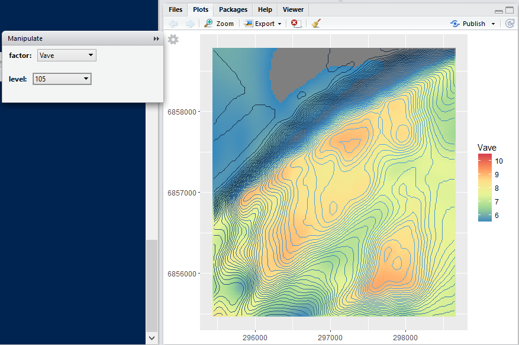
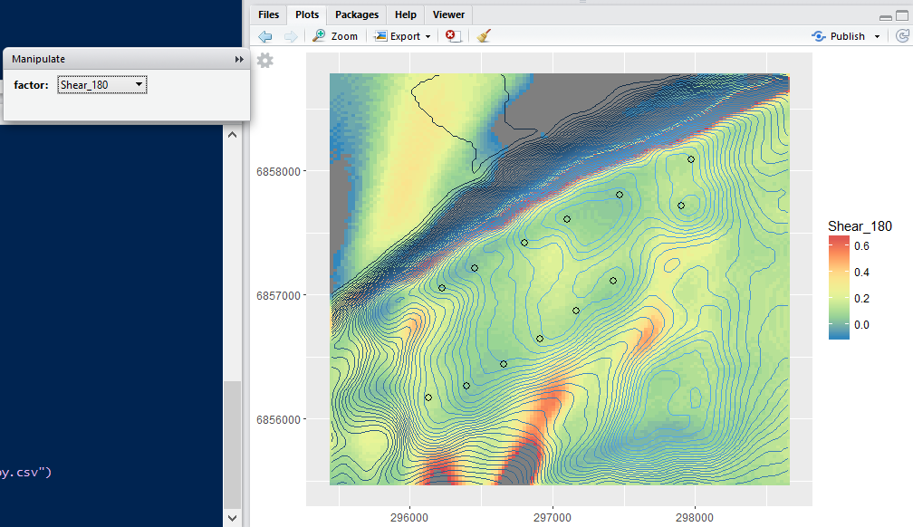

## rsf

`rsf` package provides functions to make some basic manipulation on wind ressource file (*.rsf) and some plot functions to visualise inputs and outputs.

## Install from Github using R:

Development version on [github](https://github.com/Umercia/rsf)

```r
install.packages("devtools")
library("devtools")

install_github('rsf',  username='umercia')
library("rsf")

```

## Usage examples
```r
library(rsf)
# Transform one rsf file
RSF_convert(rsf_file1 = "RSF-windresource-CFD_Hennoid [80m].rsf",  # rsf file name at H1=80m (*rsf)
            crop = TRUE,    # ask to crop the map around the wind farm (default value = 700 m around)
            layout_csv = "layout V2 Hennoid.csv",   # input file name for turbine positions (X,Y) (*csv)
            twelve_S = TRUE, # ask to convert the map from 36 sector rsf into 12
            output_name = "Hennoid") # set the output file root name
 
# In this example, the results would be exported into "[12S_0.1][crop_700]Hennoid.rsf" file 


# Create a 3 dimensional rsf based on two rsf files.
RSF_convert(rsf_file1 = "RSF-windresource-CFD_Hennoid [80m].rsf",  # first rsf file name at H1=80m (*.rsf)
            rsf_file2 = "RSF-windresource-CFD_Hennoid_[117].rsf",   # second rsf file name at H2=117m *.rsf)
            crop = TRUE,    # ask to crop the map around the wind farm (default value = 700 m around)
            layout_csv = "layout V2 Hennoid.csv",   # input file name for turbine positions (X,Y) (*csv)
            shear_out = TRUE,  # ask to ouput the wind shear (X,Y table) in a csv file
            three_D = TRUE,    # ask to build a 3 dimensional rsf 
            layer_H = c(94,105,112),    # add levels for the 3 dimensional rsf
            output_name = "Hennoid") # set the output file root name
            
# In this example, the results would be exported into "[3D][crop_700]Hennoid.rsf" and "[shear_table][crop_700]Hennoid.csv"


#Visualisation of the new 3 dimensional rsf file (*.rsf)
RSF_plot(rsf_file1 = "[3D][crop_700]Hennoid.rsf")

```




```r


#Visualisation of the shear file (*.csv)
Shear_plot(rsf_file1 = "[shear_table][crop_700]Hennoid.csv", 
           layout_csv = "layout V2 Hennoid.csv") # layout input (optional)

```




Licence
--------------
This package is free and open source software, licensed under GPL (>= 2).

